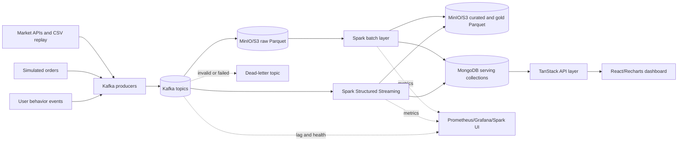

# FinSight: Big Data Financial Analytics Platform

## Milestone Project Development Plan and Report Baseline

**Architecture:** Lambda Architecture  
**Processing:** Apache Spark with PySpark  
**Message queue:** Apache Kafka  
**Distributed storage:** MinIO/S3-compatible object storage with Parquet; HDFS is an alternative deployment profile  
**Serving database:** MongoDB  
**Deployment:** Kubernetes or a managed cloud Kubernetes service  
**Visualization:** Existing React/TanStack dashboard with Recharts  
**Delivery window:** Target completion in 5 weeks with 4 team members; Week 6 is contingency only  
**Document status:** Five-week delivery baseline with a hard six-week limit; implementation results must be added after execution

> This document is the working plan for the Big Data milestone. It describes the target architecture, implementation tasks, verification evidence and lessons to record. It does not claim that Spark, Kafka, MongoDB or Kubernetes are already implemented in the current codebase.

---

# Executive Summary

FinSight is a real-time financial analytics platform for processing market quotes, simulated trades and investor-behavior events. The system will help learners inspect portfolio risk, market movement and behavioral patterns without executing real-money trades.

The existing project provides a useful application layer: React/TanStack screens, authentication, simulated trading, Supabase/PostgreSQL persistence, market-data integrations and Recharts visualizations. The milestone work will extend that application with a genuine Big Data layer. Kafka will provide durable event ingestion, Spark will provide batch and streaming processing, MinIO will provide distributed object storage, MongoDB will provide low-latency serving views, and Kubernetes will provide reproducible deployment and service discovery.

The recommended architecture is Lambda because the project must demonstrate both historical batch analytics and near-real-time stream processing. The batch layer will rebuild curated datasets and long-window analytics from Parquet files. The speed layer will process Kafka events with Spark Structured Streaming and publish fresh metrics to MongoDB. The serving layer will expose a stable API to the existing dashboard.

The milestone is successful when a reviewer can follow an event from ingestion to processing, storage and visualization; inspect Spark transformations and execution plans; observe late-data and recovery behavior; query a NoSQL serving view; and reproduce the deployment and tests. All throughput, latency, accuracy and recovery claims must be supported by recorded measurements.

---

# 1. Problem Definition

## 1.1 Selected Problem

Financial data is produced by different providers and at different time scales. Market quotes arrive continuously, historical prices are collected in batches, simulated orders are generated by users, and behavior signals are derived from sequences of actions. A relational web application can support a small pilot, but it does not demonstrate how to ingest, process, store and analyze a growing stream of heterogeneous events at scale.

FinSight addresses this problem by building an end-to-end platform that combines:

- Multi-source market-data ingestion.
- Simulated trade and portfolio events.
- Real-time market and portfolio indicators.
- Historical risk and behavior analytics.
- NoSQL serving views for interactive dashboards.
- A reproducible, observable distributed deployment.

The system is educational and analytical. It is not a brokerage, does not execute real trades, does not hold user money and does not provide investment advice.

## 1.2 Why This Is Suitable for Big Data

The problem has the three dimensions relevant to the course:

| Dimension | FinSight example | Big Data treatment |
| --- | --- | --- |
| Volume | Historical quotes, trades and action logs are replayed as a large event dataset | Parquet, partition pruning, Spark batch and distributed storage |
| Velocity | New quotes and user actions arrive continuously | Kafka, Structured Streaming, windows, state and checkpoints |
| Variety | Provider JSON/CSV, trade events, portfolio snapshots and behavior records | Versioned event contracts, schema validation and multi-stage transformations |

The project will use a documented synthetic replay in addition to permitted external data. The five-week target uses at least 1 million events for functional scale testing; 10 million events is a stretch target if the declared hardware can support it. The exact record count, event rate and dataset size must be measured and reported rather than assumed.

## 1.3 Scope

### In scope

- Market quotes and daily historical prices.
- Simulated orders, portfolio snapshots and user-action events.
- Kafka topics, producers, schemas and a dead-letter topic.
- Raw, curated and analytics data in MinIO/S3-compatible storage.
- Spark batch and Spark Structured Streaming jobs.
- Windowed market metrics, portfolio risk metrics and behavioral analytics.
- MongoDB serving collections and indexes.
- React dashboard integration through a serving API.
- Kubernetes deployment, monitoring, testing and recovery demonstrations.
- Documentation of the required lessons learned.

### Out of scope

- Real-money trading, deposits or withdrawals.
- Brokerage connectivity, margin, short selling or tax advice.
- Guaranteed price forecasts or personalized financial advice.
- Production-grade high availability beyond the demonstrated cluster profile.
- Unlicensed redistribution of provider data.
- A full institutional learning-management system.

## 1.4 Limitations and Assumptions

- External providers may impose quotas, delays, schema changes or usage restrictions.
- A student cluster cannot represent the capacity of a production financial platform.
- Synthetic data is valid for testing processing behavior but cannot prove business demand.
- Behavioral labels are analytical heuristics or unsupervised segments, not psychological diagnoses.
- Kubernetes on Minikube or Kind is acceptable for reproducibility, but the report must state the hardware and resource limits.
- Supabase/PostgreSQL remains useful for authentication and operational application data; it is not used as the primary Big Data processing store.

---

# 2. Objectives and Acceptance Criteria

## 2.1 Technical Objectives

1. Build a complete ingestion → processing → storage → visualization pipeline.
2. Demonstrate a Lambda Architecture with separate batch and speed paths.
3. Use Apache Spark for both historical and streaming computation.
4. Use Kafka as a durable event log with replayable topics and a dead-letter path.
5. Use Parquet on MinIO/S3-compatible storage for raw and curated data.
6. Use MongoDB as a NoSQL serving layer for dashboard queries.
7. Deploy the platform on Kubernetes or a managed cloud Kubernetes service.
8. Demonstrate Spark transformations, joins, optimization, state management and advanced analytics.
9. Measure data quality, latency, throughput, resource use and recovery behavior.
10. Produce a report that distinguishes implemented behavior, measured results, limitations and future work.

## 2.2 Acceptance Matrix

| ID | Acceptance condition | Evidence required |
| --- | --- | --- |
| AC-01 | Events from at least three source types enter Kafka | Producer logs, topic listing, sample payloads and schema validation output |
| AC-02 | Raw events are retained in object storage | MinIO bucket layout, Parquet files, partition listing and retention policy |
| AC-03 | A Spark batch job rebuilds curated and gold datasets | Source code, successful run log, Spark UI screenshot and output samples |
| AC-04 | A Spark streaming job processes Kafka events continuously | Query status, checkpoint directory, output-mode demonstration and latency measurements |
| AC-05 | Late and duplicate events are handled deterministically | Watermark test, duplicate test, late-event report and final counts |
| AC-06 | Required aggregations and joins are implemented | Code, unit tests, `explain("formatted")` output and result validation |
| AC-07 | At least one MLlib workflow and one GraphFrames workflow run | Feature pipeline, evaluation/graph metrics and persisted results |
| AC-08 | MongoDB serves analytics to the dashboard | Collection schema, indexes, API response and UI screenshot |
| AC-09 | The platform runs through Kubernetes manifests | `kubectl` output, service endpoints, configuration guide and deployment recording |
| AC-10 | Monitoring exposes system and data-pipeline health | Dashboard panels, alert rules and a fault-injection log |
| AC-11 | Quality and security checks pass | Data-quality report, unit/integration/performance tests and access-control evidence |
| AC-12 | All lessons use the required four-part structure | Completed lessons with measured evidence and trade-off analysis |

## 2.3 Suggested Performance Targets

These are targets for the milestone experiment, not production guarantees:

- Process at least 1 million replayed events in the declared test environment; attempt 10 million as a stretch run when hardware permits.
- Sustain a documented streaming replay rate without unbounded Kafka lag.
- Keep the measured p95 event-to-serving latency at or below 60 seconds for the baseline demo load.
- Produce zero duplicate serving records for a replay with the same event IDs.
- Classify every event arriving beyond the configured watermark as either accepted-late or too-late according to the documented policy.
- Record batch runtime, input size, shuffle volume, peak memory, CPU use and output size.

If hardware prevents a target from being reached, report the measured limit and explain the bottleneck; do not silently lower the target after testing.

---

# 3 Current Baseline and Target State

## 3.1 Existing Application Layer

The current project already contains the following reusable parts:

- React 19, TanStack Start/Router/Query and TypeScript.
- Simulated trading, portfolio and behavioral screens.
- Supabase authentication and PostgreSQL migrations.
- Market-data refresh through Edge Functions and scheduled jobs.
- Recharts visualizations.
- Cloudflare/TanStack configuration for the web application.

These components will remain the learner-facing application and operational identity layer. The Big Data milestone adds a separate data platform rather than replacing the user interface immediately.

## 3.2 Main Gaps to Close

| Current state | Target state |
| --- | --- |
| Provider refresh and database writes | Versioned event producers publishing to Kafka |
| PostgreSQL historical tables | Raw and curated Parquet in MinIO/S3-compatible storage |
| Browser/server-side calculations | Spark batch and Structured Streaming jobs |
| Supabase Realtime notifications | Kafka event log plus Spark stateful processing |
| PostgreSQL as the only analytical store | MongoDB serving views backed by Spark outputs |
| Web/cloud configuration only | Kubernetes deployment, service discovery and monitoring |
| Heuristic dashboard metrics | Reproducible Spark analytics with recorded data lineage |

The project must not claim that Supabase Realtime is Kafka or that a PostgreSQL table is distributed storage. They may coexist with the Big Data platform but do not replace the required components.

---

# 4 Architecture and Design

## 4.1 Architecture Decision

### Selected model: Lambda Architecture

Lambda is selected because the milestone requires both batch and streaming demonstrations:

- The batch layer can rebuild results from complete historical data.
- The speed layer can publish fresh metrics while data is arriving.
- The serving layer can expose both results through stable collections.
- Reprocessing the batch layer provides a way to correct logic or recover from a corrupted speed-layer state.

Kappa Architecture remains a possible future simplification if the team later proves that all analytics can be replayed from Kafka without a separate batch implementation. It is not the selected milestone architecture because the course rubric explicitly rewards distinct batch optimization and streaming behavior.

## 4.2 Overall Data-Flow Diagram



## 4.3 Component Responsibilities

| Component | Responsibility | Required evidence |
| --- | --- | --- |
| Market producers | Fetch/parse permitted sources and attach provenance | Source adapters, retry policy, source timestamps and provider-error tests |
| Application producer | Publish order, portfolio and user-action events | Event IDs, schema version, authenticated user mapping and retry behavior |
| Kafka | Durable transport, partitioning, retention and replay | Topics, keys, consumer groups, offsets and lag measurements |
| MinIO/S3 or HDFS | Immutable raw and curated storage | Bucket layout, Parquet schema, compression and retention |
| Spark batch | Rebuild historical datasets and long-window analytics | Jobs, plans, metrics and output validation |
| Spark streaming | Process current events and maintain stateful metrics | Watermark, checkpoint, output mode, state and recovery evidence |
| MongoDB | Low-latency analytics serving views | Collections, indexes, idempotent upserts and query timings |
| TanStack API | Read serving views and apply application authorization | API contracts, error handling and access tests |
| React dashboard | Visualize market, portfolio, risk and behavior outputs | Screens, loading/error states and end-to-end demo |
| Kubernetes | Deploy, discover, restart and scale services | Manifests, service status, rollout and recovery test |
| Monitoring stack | Observe health, performance and data quality | Dashboards, alerts, logs and incident timeline |

## 4.4 Event Contract

Every event must contain the following envelope:

| Field | Requirement |
| --- | --- |
| `event_id` | Globally unique and stable across retries |
| `event_type` | `market_quote`, `trade`, `portfolio_snapshot` or `user_action` |
| `schema_version` | Versioned contract identifier |
| `source` | Provider, application or replay job name |
| `event_time` | Time at which the business event occurred |
| `ingestion_time` | Time at which the platform accepted the event |
| `asset_symbol` | Normalized asset key where applicable |
| `user_id` | Opaque identifier for user-related events; absent for public market data |
| `payload` | Type-specific validated fields |

Kafka keys should preserve per-asset ordering for market events and per-user ordering for behavior events. The schema registry or versioned JSON schema files must reject incompatible payloads before they enter the main processing path.

## 4.5 Storage Layout

```text
fin-sight/
  bronze/
    event_type=market_quote/event_date=YYYY-MM-DD/part-*.parquet
    event_type=trade/event_date=YYYY-MM-DD/part-*.parquet
    event_type=user_action/event_date=YYYY-MM-DD/part-*.parquet
  silver/
    market_quotes/event_date=YYYY-MM-DD/asset_symbol=...
    trades/event_date=YYYY-MM-DD/
    behavior_events/event_date=YYYY-MM-DD/
  gold/
    market_metrics/event_date=YYYY-MM-DD/
    portfolio_risk/event_date=YYYY-MM-DD/
    investor_segments/event_date=YYYY-MM-DD/
```

Use Parquet with Snappy compression. Partition by event date and a low-to-medium cardinality dimension. Do not partition by user ID if it creates many small files. Use bucketing by asset symbol where it improves the planned join workload, and verify the decision with Spark plans and measurements.

## 4.6 Streaming Semantics

- Immutable event ingestion uses append mode.
- Windowed aggregations use update mode for changing current metrics.
- A small demonstration query uses complete mode to show the trade-off and is not used for the high-volume path.
- The default watermark is 10 minutes and must be configurable.
- Events inside the watermark are incorporated into the correct window.
- Events beyond the accepted lateness policy are counted and sent to a late-event output for inspection.
- Checkpoints are stored on persistent storage.
- Deterministic `event_id` upserts in MongoDB make the sink idempotent across retries.
- Recovery tests must stop and restart a streaming query and compare output counts before and after recovery.

---

# 5 Implementation Plan

## 5.1 Repository Layout

The following structure is the target for the Big Data extension:

```text
data-contracts/
  events.schema.json
  README.md
ingestion/
  producers/market_producer.py
  producers/app_event_producer.ts
  tests/
storage/
  minio/README.md
  mongodb/indexes.js
spark/
  lib/schemas.py
  lib/quality.py
  jobs/batch/market_batch.py
  jobs/batch/portfolio_batch.py
  jobs/streaming/market_stream.py
  jobs/streaming/behavior_stream.py
  jobs/analytics/behavior_ml.py
  jobs/analytics/market_graph.py
  tests/
serving/
  api_contract.md
  mongo_sink.py
deploy/k8s/
  namespace.yaml
  kafka.yaml
  minio.yaml
  mongodb.yaml
  spark.yaml
  app.yaml
  monitoring.yaml
monitoring/
  dashboards/
  alerts/
tests/
  data_quality/
  integration/
  performance/
src/
  existing React application and new analytics API adapters
```

## 5.2 Five-Week Target Schedule and Week 6 Contingency

The target plan assumes four members contributing approximately 12 hours per week for five weeks: 240 gross person-hours. A 15 percent integration and recovery reserve leaves 204 planned hours, or approximately 51 planned hours per member. Week 6 can add at most 48 recovery hours, but it is opened only for unresolved Must items; it is not pre-filled with new features. The team should submit at the end of Week 5 as soon as every exit gate and evidence item passes.

| Week | Person A — Ingestion and storage | Person B — Batch and advanced analytics | Person C — Streaming and serving | Person D — Platform and visualization | Integrated exit gate |
| --- | --- | --- | --- | --- | --- |
| 1 — Compatibility foundation | Freeze event contracts; create producer fixture and Kafka topics; validate source fields | Create Spark skeleton, deterministic fixtures and reference calculations; prove required Spark packages load | Define MongoDB, streaming-output and API contracts; design deterministic serving keys | Pin Java/Python/Spark/Kafka/connectors; create image build baseline; deploy the Kubernetes infrastructure profile | Core services start; Kafka, S3A, Mongo and GraphFrames compatibility is proven; one valid event reaches Kafka |
| 2 — Batch vertical slice | Implement producers, bronze landing, Parquet/Snappy layout, quality counters and replay | Implement bronze-to-silver-to-gold transformations, aggregations, UDF/UDAF and initial joins | Implement MongoDB indexes, batch upsert path and API contract | Add workload manifests, observability skeleton and dashboard shell | Kafka → MinIO → Spark batch → MongoDB → API works on deterministic data |
| 3 — Streaming vertical slice | Add duplicate/late fixtures, dead-letter flow, replay control and source metrics | Complete MLlib, GraphFrames, statistical outputs and join experiments | Implement Structured Streaming windows, watermark, state, checkpoints and `foreachBatch` idempotent upserts | Connect live dashboard states and monitoring panels; run streaming smoke tests | Live events reach the dashboard; restart and replay preserve final serving counts |
| 4 — Hardening and optimization | Test schema evolution/provider failure; document storage lifecycle, security and source quality | Measure broadcast/sort-merge/multi-join plans, pruning, catalog-backed bucketing, caching, AQE and resource use | Reconcile Lambda batch/speed views; test late data, duplicates, authorization and recovery | Run Kubernetes fault tests, alert checks, UI hardening and end-to-end regression | Every technical Must has source, test and evidence; no unresolved correctness defect remains |
| 5 — Evidence and submission | Final ingestion/storage tests and Lessons 1, 4, 9 and 10 | One-million-event baseline and Lessons 2, 6 and 8 | Final API/stream tests and Lessons 3, 5 and 11 | Clean deployment, demo recording, Lesson 7, traceability and editorial assembly | Clean-environment demo passes; all Must evidence is linked; report contains measured results and explicit limitations |
| 6 — Conditional contingency | Fix unresolved Must defects only | Re-run failed correctness/performance evidence only | Fix reconciliation/recovery/API blockers only | Restore deployment/demo reproducibility and assemble corrected evidence | Used only if the Week 5 gate fails; no new feature begins, and 10-million-event stretch work is allowed only after all Must items pass |

## 5.3 Balanced Four-Person Workstreams and Working Rules

| Member | End-to-end ownership | Required cross-cutting deliverables | Planned effort |
| --- | --- | --- | --- |
| Person A — Ingestion and Storage Engineer | Event contracts, producers, Kafka, raw landing, MinIO/Parquet, replay and source data quality | Own tests, metrics, container/workload configuration and evidence for this workstream; draft Lessons 1, 4, 9 and 10 | About 51 hours |
| Person B — Batch and Advanced Analytics Engineer | Spark batch, aggregations, UDF/UDAF, joins, optimization, statistics, MLlib and GraphFrames | Own tests, metrics, container/workload configuration and evidence for this workstream; draft Lessons 2, 6 and 8 | About 51 hours |
| Person C — Streaming and Serving Engineer | Structured Streaming, state/watermarks/checkpoints, idempotent MongoDB sink, Lambda reconciliation, API and authorization | Own tests, metrics, container/workload configuration and evidence for this workstream; draft Lessons 3, 5 and 11 | About 51 hours |
| Person D — Platform and Visualization Engineer | Version matrix, shared image/deployment tooling, Kubernetes infrastructure, monitoring and React/Recharts visualization | Own platform/e2e tests, demo runbook and Lesson 7; edit the final report but does not write other members' evidence for them | About 51 hours |

Planned-hour budget (the remaining capacity up to 12 hours per member per week is the shared integration reserve):

| Member | Week 1 | Week 2 | Week 3 | Week 4 | Week 5 | Planned total |
| --- | ---: | ---: | ---: | ---: | ---: | ---: |
| Person A | 11 | 11 | 10 | 10 | 9 | 51 |
| Person B | 9 | 12 | 11 | 11 | 8 | 51 |
| Person C | 8 | 10 | 12 | 12 | 9 | 51 |
| Person D | 12 | 8 | 9 | 10 | 12 | 51 |
| **Team** | **40** | **41** | **42** | **43** | **38** | **204** |

Working rules:

- Hold a 15-minute daily sync with one blocker list and one measurable exit criterion.
- Each member owns implementation, unit/integration tests, metrics, Kubernetes workload configuration and evidence for their workstream; Person D owns only the shared platform and final integration.
- Each member reviews another member's work before it enters the integrated branch.
- Merge only work that has a reproducible command, test or screenshot attached.
- Freeze the MVP and compatibility matrix at the end of Week 1; defer optional features immediately when a Must item is at risk.
- Run the full vertical slice at the end of every week. Finish before Week 5 if all Must gates already pass; open Week 6 only by an explicit go/no-go decision after the Week 5 gate.

## 5.4 Five-Week Scope Control

| Priority | Included in the target milestone | Deferred or stretch |
| --- | --- | --- |
| Must | One Lambda vertical slice; three event types; Kafka; MinIO/Parquet; Spark batch; Spark streaming with watermark/state/checkpoint; deterministic `foreachBatch` upserts; batch/speed reconciliation; one MLlib model; one GraphFrames analysis; MongoDB; Kubernetes; monitoring; quality/security/recovery tests | — |
| Stretch | 10-million-event run; more than three market providers; autoscaling experiment; richer dashboard pages | Only after all Must evidence passes; may use spare Week 5 time or Week 6 contingency |
| Deferred | AI coaching, leaderboard/gamification refinement, full limit/stop order lifecycle, multi-region deployment, production-grade HA and commercial features | Future work, not part of milestone acceptance |

## 5.5 Spark Requirement Coverage

| Course requirement | Planned implementation | Verification |
| --- | --- | --- |
| Window functions | Rolling return, volatility, moving average and user activity windows | Boundary tests and output comparison with a reference calculation |
| Advanced aggregation | `rollup`, `cube`, percentile statistics and custom weighted-volatility aggregation | Schema/output tests and runtime measurement |
| Pivot/unpivot | Pivot metrics by asset type/source; unpivot wide gold metrics for serving | Row-count and value-preservation tests |
| Custom UDF | Business classification of trade intensity and behavior signals | UDF unit tests and null/invalid input cases |
| Broadcast join | Join quotes to the small asset dimension | Physical plan shows broadcast; compare runtime |
| Sort-merge join | Join large quotes and trades by symbol/date | Physical plan and shuffle measurement |
| Multiple-join optimization | Orders + quotes + asset dimension + behavior events | Reordered plan, reduced scans/shuffles and regression test |
| Partition pruning | Filter event date and verify only required partitions are read | Spark plan and input-file count |
| Bucketing | Bucket selected curated tables by asset symbol | Join plan and benchmark against non-bucketed version |
| Cache/persistence | Persist reused silver data and release it after dependent actions | Storage tab and runtime comparison |
| Query optimization | AQE, join strategy, file sizing and `explain("formatted")` | Before/after benchmark with configuration recorded |
| Streaming modes | Append, update and controlled complete-mode examples | Query status and output comparison |
| Watermark/late data | 10-minute default with configurable threshold | Replay fixture with on-time, late and too-late events |
| State/recovery | Stateful window aggregation with persistent checkpoint | Stop/restart test and output reconciliation |
| Exactly-once outcome | Checkpointed source plus deterministic MongoDB upsert by event/window key | Replay test with no duplicate serving records |
| MLlib | KMeans investor segments using behavioral and portfolio features | Silhouette score, cluster profile and feature lineage |
| GraphFrames | User-asset interaction graph with degree/PageRank/community metrics | Graph output counts and interpretation limits |
| Statistics/time series | Returns, variance, z-score, drawdown and rolling correlation | Reference calculations and error tolerance |

---

# 6 Implementation Details

## 6.1 Batch Layer

The batch layer reads bronze Parquet, validates schemas and data-quality constraints, normalizes symbols and timestamps, removes duplicates by event ID, and writes silver data. Gold jobs compute daily and rolling metrics, portfolio risk, behavior features and model-ready datasets.

Batch jobs must be restartable and parameterized by input date range, output path, run ID and configuration file. Every run writes a small metadata record containing input partitions, code version, configuration, row counts, rejected rows and output locations.

## 6.2 Speed Layer

The streaming layer consumes Kafka using explicit consumer groups. It validates payloads, applies event-time windows and watermarks, updates stateful metrics, and writes both operational metrics and serving views. Invalid records go to a dead-letter path with the original payload, error code and processing timestamp.

The stream must not silently replace a current quote with a stale value. The dashboard must show quote age and source. If a provider fails, the pipeline exposes a bounded stale-data state rather than presenting the old value as current.

## 6.3 Serving Layer

MongoDB collections should include at least:

- `latest_market_metrics`
- `portfolio_risk_views`
- `investor_behavior_segments`
- `asset_time_series_summary`
- `pipeline_quality_metrics`

Every serving document must contain a computation timestamp, source window, pipeline run ID and data freshness field. Unique indexes must support idempotent upserts and the API must return freshness and source metadata to the dashboard.

## 6.4 Frontend Integration

The existing React dashboard will consume analytics through a thin API adapter. It will show:

- Current quote and quote age.
- Rolling volatility and moving averages.
- Portfolio drawdown, concentration and risk segment.
- Investor behavior segment and contributing features.
- Data-pipeline status and freshness for the demonstration environment.

The UI must label analytical segments as educational signals, not psychological diagnoses or investment recommendations.

---

# 7 Deployment and Monitoring

## 7.1 Kubernetes Deployment

The Kubernetes profile must provide:

- A namespace for FinSight.
- Kafka broker/controller configuration and persistent volumes.
- MinIO with persistent storage.
- MongoDB with persistent storage and indexes.
- Spark driver/executor or Spark Operator resources.
- Producer, batch-job and streaming-job deployments/jobs.
- API/frontend services and ingress or port-forward instructions.
- ConfigMaps for non-secret settings and Secrets for credentials.
- Resource requests and limits for every workload.

Docker images may be used as container artifacts, but the assessment evidence must show Kubernetes deployment, service discovery, restart behavior and resource configuration.

## 7.2 Observability

Expose or record:

- Kafka consumer lag and throughput.
- Spark input rate, processing rate, batch duration, state rows and failed batches.
- Watermark delay and late-event counts.
- MongoDB query latency, write errors and duplicate-key/upsert counts.
- Data-quality rejection counts by rule and source.
- API response latency and error rate.
- CPU, memory, disk and network use.

Prometheus and Grafana are the preferred monitoring stack. Spark UI and structured JSON logs supplement the dashboards. Alerts should cover consumer lag, failed streaming batches, stale market data, storage capacity, high rejection rates and API error spikes.

## 7.3 Failure Demonstrations

The final demo must include at least three controlled failures:

1. Stop a producer or external provider and show retry, circuit-breaker or dead-letter behavior.
2. Stop and restart the streaming job and reconcile output counts.
3. Submit duplicate and late events and show deterministic final results.

---

# 8 Data Quality, Testing, Security and Governance

## 8.1 Data Quality Rules

- Required event IDs are non-empty and unique after deduplication.
- Event time is parseable and within the documented acceptable range.
- Price, quantity and volume are finite and non-negative where applicable.
- Symbols belong to the reference asset dimension or are explicitly quarantined.
- Source and schema version are present.
- Duplicate rate, null rate, rejected count and late-event count are recorded per batch/window.
- Gold totals reconcile with silver input totals within documented rules.

## 8.2 Test Layers

| Test layer | Coverage |
| --- | --- |
| Unit | Parsers, schemas, UDFs, aggregations, risk formulas and feature engineering |
| Data quality | Invalid fields, nulls, duplicate IDs, unknown symbols and out-of-order events |
| Integration | Kafka → Spark → MinIO/MongoDB and API → dashboard |
| Streaming | Watermark, state, checkpoint, restart and replay behavior |
| Performance | Dataset scale, throughput, latency, memory, shuffle and query timings |
| Security | Secret handling, MongoDB credentials, API authorization and user-data isolation |
| Recovery | Provider outage, broker restart, worker restart, corrupted input and backup restore |

## 8.3 Security and Governance

- Keep provider keys and database credentials in Kubernetes Secrets or the cloud secret manager.
- Never commit `.env` files or service-role keys.
- Use least-privilege accounts for producers, Spark jobs, MongoDB and dashboard API.
- Hash or pseudonymize user identifiers in analytical datasets.
- Keep an audit record for administrative access and data exports.
- Document provider licensing, retention and attribution requirements.
- Separate synthetic test data, pilot data and production-like configuration.

---

# 9 Required Report Deliverables

The final report must contain:

1. Problem definition, Big Data suitability, scope and limitations.
2. Lambda Architecture decision and comparison with Kappa Architecture.
3. Overall architecture diagram and component/data-flow diagrams.
4. Event schemas and data dictionary.
5. Source-code structure and implementation explanation.
6. Spark transformation, join and optimization evidence.
7. Streaming semantics, late-data, state and recovery evidence.
8. Storage format, partitioning, compression and hot/cold-data decisions.
9. NoSQL schema, serving API and visualization evidence.
10. Kubernetes deployment and monitoring setup.
11. Data-quality, testing, security and governance results.
12. The eleven lessons learned in the required four-part format.
13. Measured metrics, limitations, risks and future work.

The report must label each item as implemented, partially implemented, simulated, measured, or deferred. Screenshots without a reproducible command or configuration are not sufficient evidence.

---

# 10 Lessons Learned Plan

The sections below are the required structure for the final report. Before submission, replace planned evidence with actual experiment IDs, measurements, screenshots, logs and commit references. No result is claimed in this baseline document.

## Lesson 1: Reliable Multi-Source Data Ingestion

### Problem Description

- Market providers expose different formats, timestamps, symbols, quotas and failure modes.
- User events and replay data may arrive late, duplicated or with different schema versions.
- Inconsistent ingestion can corrupt downstream metrics and make results impossible to reproduce.

### Approaches Tried

- Direct writes from the web application to the database: simple, but weak replayability and poor source isolation.
- Scheduled provider refresh into Kafka: durable and replayable, but requires schemas, retries and monitoring.
- Final decision: use versioned Kafka events with source metadata and a dead-letter path.

### Final Solution

Implement typed producers, stable event IDs, schema validation, retry/backoff, source timestamps, ingestion timestamps and deduplication. Measure accepted, rejected, duplicate, late and unknown-symbol rates per source.

### Key Takeaways

- Validate at ingestion and preserve the original payload for diagnosis.
- Treat event time and ingestion time as different fields.
- Never hide a provider failure behind an apparently current value.

## Lesson 2: Spark Job Optimization and Memory Management

### Problem Description

- Large joins and wide aggregations can create shuffle, skew, executor memory pressure and long runtimes.
- A correct Spark job can still fail the milestone if its execution plan and resource behavior are not understood.

### Approaches Tried

- Default join and partition settings: simplest baseline, used for comparison.
- Broadcast small dimensions, repartition large inputs, enable AQE and tune file sizes: better when supported by measurements.
- Caching reused data: useful for repeated actions, harmful when storage memory is insufficient.

### Final Solution

Record baseline and optimized plans with `explain("formatted")`, Spark UI metrics, partition counts, shuffle size, runtime and peak memory. Apply only optimizations supported by the workload rather than copying configuration values blindly.

### Key Takeaways

- Optimize from a measured plan, not from intuition.
- Release cached data after its dependent actions.
- Report resource limits and skew instead of hiding them.

## Lesson 3: Exactly-Once Outcomes in Stream Processing

### Problem Description

- A streaming job can retry a micro-batch after a process failure.
- Rewriting a result without idempotency can duplicate metrics or serving documents.

### Approaches Tried

- At-least-once writes with no deduplication: operationally simple but unsafe for financial totals.
- Checkpointed Spark query plus deterministic MongoDB upserts: stronger effective exactly-once outcome, with sink-key design required.
- Full distributed transactions: stronger semantics but too complex for the milestone environment.

### Final Solution

Use Kafka offsets and Spark checkpoints for source progress, stable event/window keys for MongoDB upserts, and reconciliation tests after restart and replay. State the exact boundary of the guarantee: effective exactly-once results for the selected sink, not an unqualified claim for every external provider.

### Key Takeaways

- Exactly-once is an end-to-end design property, not a checkbox in one component.
- Idempotent sinks and deterministic keys are essential.
- Recovery tests must compare final results, not only process status.

## Lesson 4: Storage Format, Partitioning and Hot/Cold Data

### Problem Description

- Row-oriented operational tables are convenient for transactions but inefficient for large analytical scans.
- Poor partitions create small files, full scans and expensive joins.

### Approaches Tried

- PostgreSQL for all data: familiar and useful for operations, but not the distributed analytical layer required by the course.
- JSON files: flexible for raw capture, but inefficient for repeated analytics.
- Parquet with Snappy on MinIO and MongoDB for serving: chosen for columnar batch processing and low-latency reads.

### Final Solution

Use bronze/silver/gold Parquet zones, partition by event date and suitable dimensions, compress with Snappy, compact small files, and keep current dashboard documents in MongoDB. Measure scan size and query latency before and after pruning.

### Key Takeaways

- Storage format should follow access patterns.
- Partition keys need controlled cardinality.
- Hot serving data and cold analytical history should have different representations.

## Lesson 5: Integration, Error Handling and Service Discovery

### Problem Description

- The platform contains producers, brokers, Spark jobs, storage systems, APIs and a dashboard.
- A single unavailable dependency must not create cascading failures or misleading results.

### Approaches Tried

- Hard-coded hostnames: easy locally, fragile in deployment.
- Kubernetes Services and configuration-driven endpoints: portable and discoverable.
- Retries without limits: can overload a failing dependency.

### Final Solution

Use Kubernetes service names, ConfigMaps, Secrets, bounded retries with exponential backoff, timeouts, circuit-breaker behavior at external-provider/API boundaries and a dead-letter path for records that cannot be processed.

### Key Takeaways

- Service discovery is part of the architecture, not a deployment afterthought.
- Error handling must preserve data lineage.
- Retry policies need limits and observability.

## Lesson 6: Performance Optimization and Bottleneck Analysis

### Problem Description

- End-to-end latency can be caused by Kafka lag, Spark scheduling, shuffle, storage I/O, MongoDB indexes or API serialization.
- Improving one component can move the bottleneck elsewhere.

### Approaches Tried

- Optimize only Spark transformations: insufficient when the serving database is the bottleneck.
- Add caching everywhere: can increase memory pressure.
- Measure each stage and optimize the dominant bottleneck: selected approach.

### Final Solution

Record throughput, p50/p95 latency, Kafka lag, Spark batch duration, shuffle, storage I/O, MongoDB query time and API latency. Use the measurements to select caching, partition, index, resource or query changes.

### Key Takeaways

- Performance is a pipeline property.
- Every optimization needs a before/after measurement.
- Resource allocation should follow observed bottlenecks.

## Lesson 7: Monitoring, Debugging and Root-Cause Analysis

### Problem Description

- Distributed failures are difficult to diagnose from one application log.
- Data correctness failures may not appear as process failures.

### Approaches Tried

- Console logs only: insufficient for cross-service diagnosis.
- Component metrics without correlation IDs: useful but hard to connect.
- Structured logs, run IDs, event IDs, metrics and dashboards: selected approach.

### Final Solution

Use JSON logs, correlation/run IDs, Prometheus metrics, Grafana dashboards, Spark UI and alert rules. For each injected failure, record timeline, symptom, metric, root cause, recovery and prevention.

### Key Takeaways

- Monitor data quality as well as infrastructure health.
- Correlation IDs reduce debugging time.
- A useful alert must lead to an actionable investigation.

## Lesson 8: Horizontal Scaling and Resource Planning

### Problem Description

- Increasing event rate can require more Kafka partitions, Spark executors, storage capacity or MongoDB capacity.
- Vertical scaling is simpler but has hardware limits and cost risks.

### Approaches Tried

- Increase CPU/memory on one worker: useful for a baseline, limited for sustained growth.
- Add partitions and workers: improves parallelism but introduces coordination and skew concerns.
- Autoscaling: useful in cloud but requires metrics and resource limits.

### Final Solution

Run controlled scale experiments by changing Kafka partitions, Spark executor count and resource limits. Report throughput, latency, cost/resource use and the point at which scaling no longer helps.

### Key Takeaways

- Scale the bottleneck, not every component.
- Partition count and key distribution determine usable parallelism.
- Cost and recovery behavior belong in scaling decisions.

## Lesson 9: Data Quality and Testing

### Problem Description

- A pipeline can complete successfully while producing incorrect totals, missing events or stale metrics.
- Streaming behavior requires tests for time order, duplicates, restarts and state.

### Approaches Tried

- Manual dashboard inspection: useful for a demo, not reproducible.
- Unit tests only: do not prove integration or recovery.
- Layered unit, data-quality, integration, performance and recovery tests: selected approach.

### Final Solution

Create deterministic fixtures, schema tests, reconciliation checks, streaming replay scenarios, performance runs and end-to-end checks. Store test conditions and results with the report.

### Key Takeaways

- Test invariants such as counts, totals and uniqueness.
- Include malformed and adversarial inputs.
- A green process status is not proof of correct data.

## Lesson 10: Security, Governance and Responsible Analytics

### Problem Description

- User events and portfolio records may contain sensitive identifiers.
- Provider data may have licensing and retention constraints.
- Behavioral results can be misinterpreted as psychological or investment advice.

### Approaches Tried

- Store raw user identifiers in all analytics: easy, but excessive exposure.
- Pseudonymize analytics IDs and restrict access: selected approach.
- Present behavior labels as diagnoses: rejected because the features are heuristic.

### Final Solution

Use least-privilege service accounts, Kubernetes Secrets, pseudonymous IDs, audit logs, retention rules, provider attribution and clear educational disclaimers. Restrict user-level analytics to authorized API requests.

### Key Takeaways

- Governance starts at schema and access design.
- Privacy and licensing affect architecture.
- Analytical segments need careful language and limitations.

## Lesson 11: Fault Tolerance, Backup and Disaster Recovery

### Problem Description

- Brokers, workers, storage services and external providers can fail independently.
- Recovery without checkpoints, replicas or backups can lose data or create duplicates.

### Approaches Tried

- Restart the failed process without persistent state: simple but unsafe.
- Kafka retention, persistent checkpoints, replicated storage and MongoDB backup: selected baseline.
- Full multi-region disaster recovery: outside student milestone scope.

### Final Solution

Persist Kafka and MinIO/MongoDB data, checkpoint streaming queries, document restart procedures, back up serving metadata and run provider, broker, worker and storage recovery tests. Report recovery time, data loss, duplicate behavior and manual steps.

### Key Takeaways

- Recovery must be designed before failure occurs.
- Persistent state is only useful if restore procedures are tested.
- State the recovery boundary and limitations honestly.

---

# 11 Risks and Mitigations

| Risk | Impact | Mitigation |
| --- | --- | --- |
| Scope grows beyond team capacity | High | Freeze the MVP around one vertical slice and defer non-essential UI features |
| External provider quota or schema change | High | Use replay data, adapters, source metadata and a provider-failure test |
| Local machine cannot run all services | High | Use a declared cloud/Kubernetes profile or reduce cluster resources while documenting limits |
| Spark joins or stateful streams run out of memory | High | Start with bounded fixtures, inspect plans, tune partitions and record resource limits |
| NoSQL sink duplicates output | High | Use deterministic keys, unique indexes and replay/restart tests |
| Security credentials leak | High | Exclude `.env`, use Secrets and perform a repository secret scan |
| ML/GraphFrames results are not interpretable | Medium | Report feature lineage, evaluation metrics and limitations; keep outputs educational |
| Monitoring is added too late | Medium | Deploy metrics and structured logs with the first pipeline slice |

---

# 12 Completion Checklist

- [ ] Lambda architecture and Kappa comparison are documented.
- [ ] At least three source types publish versioned events to Kafka.
- [ ] Raw and curated Parquet data exists in MinIO/S3 or HDFS.
- [ ] Spark batch job runs with required transformations, joins and optimizations.
- [ ] Spark Structured Streaming job runs with windows, watermark, state and checkpoints.
- [ ] Duplicate, late-event and restart behavior is tested.
- [ ] MLlib, GraphFrames and statistical/time-series analytics are demonstrated.
- [ ] MongoDB serving collections and indexes are documented and queried by the API.
- [ ] Existing React dashboard displays processed results and data freshness.
- [ ] Kubernetes deployment is reproducible and monitored.
- [ ] Data quality, security, performance and recovery evidence is recorded.
- [ ] All eleven lessons use Problem Description, Approaches Tried, Final Solution and Key Takeaways.
- [ ] Final report distinguishes measured results from plans and limitations.

---

# 13 Final Demonstration Script

1. Start the Kubernetes profile and show service status.
2. Start market and application producers.
3. Show Kafka topics, partitions, consumer groups and incoming events.
4. Show raw Parquet files and partition layout in MinIO.
5. Run a Spark batch job and display its execution plan and output.
6. Start the streaming job and show watermark, processing rate and current metrics.
7. Inject a duplicate event and a late event; show the documented outcomes.
8. Restart the streaming job and reconcile final serving counts.
9. Open the React dashboard and show market, portfolio and behavior analytics from MongoDB.
10. Open Grafana/Spark UI and explain one measured bottleneck and one optimization.
11. Run the data-quality and integration test commands.
12. Explain limitations, security boundaries and future work.

The demonstration is complete only when each step has a command, screen, log or stored artifact that a reviewer can inspect.
